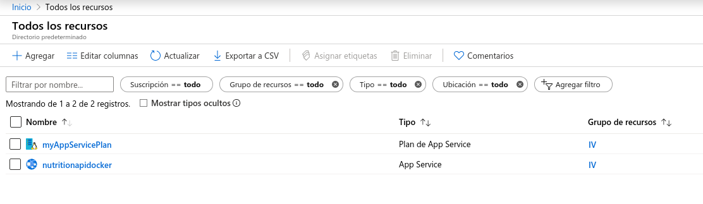

# Despliegue usando un contenedor de Docker

## Estructura

En primer lugar, para implementar el workflow, he usado el siguiente esquema:

Cuando se realiza un push a GitHub, se construirá una nueva imagen del proyecto en Docker Hub siguiendo el Dockerfile. Finalmente, cuando se actualice la imagen en Docker Hub, se actualizará automáticamente la imagen de despliegue en Azure.

## Dockerfile

El Dockerfile es un archivo que indica las directivas a seguir para construir una nueva imagen de Docker. Debe estar situado en la raíz del proyecto.

El Dockerfile de nuestro proyecto tiene la versión alpine de Node como base ya que es muy ligera. A partir de ahí copia los directorios estrictamente necesarios para que funcione el servicio, que son: 

* `src`: con los fuentes del proyecto
* `package.json`: con los scripts de arranque
* `package-lock.json`: con las dependendias a instalar
* `docs`: con el fichero yml que el sistema necesita para generar la documentación en swagger

Ya que solo se copian los archivos esctrictamente necesarios, no se necesita un archivo .dockerignore.

Por otro lado, respecto a las variables de entorno tenemos:

* `EXPOSE $PORT` para indicar que se expone el puerto que se indique en la variable de entorno `$PORT`, aunque realmente más valor que el de documentar el puerto necesario de la app, ya que no tiene efecto ninguno en la imagen. Los puertos se expondrán al ejecutar la imagen como se verá posteriormente.

* `NODE_ENV=production`: para indicar que el entorno es de producción.

Finalmente, se instalan las dependencias de producción del proyecto con `npm install ci --only=prod` y se establece como entrypoint la orden `npm run start-heroku` que es la misma orden que utilizamos al deslegar en Heroku.

## Docker Hub

El primer paso de nuestra estructura es la implementación continua entre GitHub y Docker Hub. Para configurarla tendremos que crear un repositorio público en Docker Hub y enlanzarlo a nuestra cuenta de GitHub.

Una vez enlazado a la cuenta de GitHub deberemos escoger el repo desde donde queremos que se construya:

En nuestro caso es el [repo del proyecto](https://github.com/raulsf6/Proyecto-IV). Tras seleccionar la rama master y la tag, que en nuestro caso es latest, podemos pulsar en Create & Build y se creará el nuevo repo a la vez que se construye la imagen a partir de las directivas indicadas en el Dockerfile de nuestro proyecto.

## Azure

Por último, debemos crear el recurso en Azure y activar la implemntación continua con Docker Hub.

### Creación de la webapp

Para crear la aplicación web usaremos la azure-cli. En primer lugar deberemos hacer login con `az login` que nos redirigirá a una página de login en nuestro explorador predeterminado.

Tenemos que crear un grupo de recursos en Azure, para ello ejecutaremos:

`az group create --name IV --location "West Europe"`

Donde IV es el nombre del grupo de recursos y West Europe la localización del mismo.

Después, tendremos que crear un App Service Plan, que es donde se nos agruparán las diferentes web apps (y donde se especificará el modo de pago). Para ello ejecutaremos:

`az appservice plan create --name myAppServicePlan --resource-group IV --sku F1 --is-linux`

donde especificamos el nombre con la opción --name, el grupo de recursos (que debe ser el que creamos anteriormente) con la opcion --resource-group, el plan de facturación con la orden --sku (en nuestro caso F1 ya que es el free tier) y por último la opción --is-linux para indicar que queremos que nuestras apps se alojen en una máquina Linux ya que sino no serán capaces de ejecutar Docker.

Finalmente, solo nos queda crear la aplicación propiamente dicha. Para ello ejecutaremos

`az webapp create --resource-group IV --plan myAppServicePlan --name nutritionapidocker -i raulsf6/iv:latest`

donde en --resource-group especificamos el grupo de recursos creado anteriormente, en --plan especificamos en App Service Plan creado anteriormente por su nombre, en --name el nombre de la aplicación y en -i especificamos el repositorio junto con la etiqueta correspondiente de nuestra imagen alojada en Docker Hub

### Implementación continua en Docker Hub

Finalmente tenemos que activar la implementación continua entre Docker Hub y Azure. Para ello debemos acceder al dashboard de Azure y consultar nuestra webapp recién creada. Lo podemos hacer consultando en todos los recursos y haciendo click en el nombre que le hubieramos dado.

Una vez dentro de nuestro recurso, deberemos hacer click en configuración del contenedor. Tendremos que activar la implementación continua como se muestra en la imagen y hacer click en guardar. EN este menú podremos consultar los logs del contenedor. Deberemos copiar la url que se indica en la sección Dirección URL del webbook.

Finalmente, tendremos que indicar la dirección de webhook en nuestro repositorio de Docker Hub, de forma que cada vez que se actualice la imagen, se mande una petición al webhook que implementará la webapp en azure con la nueva imagen. Para ello accedemos a nuestro repo de Docker Hub y en la pestaña de Webhooks creamos nuestro webhook dandole un nombre cualquiera, como vemos aquí:

Cabe mencionar que la URL del webhook debe permanecer en secreto. Una vez esté configurado, cada vez que hagamos un push a github se reconstruirá nuestra imagen en Docker Hub y se actualizará el despliegue en Azure

