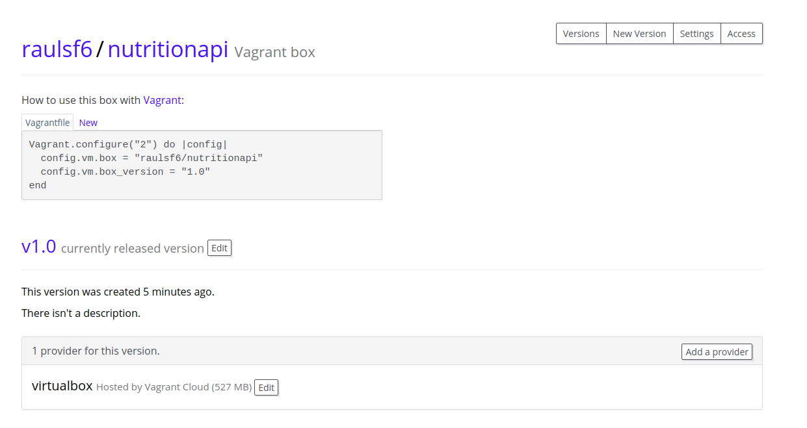

# Aprovisionamiento

## Ansible

La herramienta escogida para el aprovisionamiento es Ansible. Ansible se encarga de gestionar todas las tareas relacionadas con el aprovisionamiento tales como gestión de paquetes, gestión de usuarios, control de versiones o gestión de claves mediante el archivo [playbook.yml](https://github.com/raulsf6/Proyecto-IV/blob/master/provision/playbook.yml).

El archivo, en nuestro caso, tiene la siguiente forma:

```
- hosts: default
  tasks:
    - name: "Install apt dependencies"
      become: yes
      apt: 
        update_cache: yes 
        pkg: 
          - npm
          - nodejs
          - git
    
    - name: Add User
      become: true
      user: name=nutritionapi shell=/bin/bash
    
    - name: "Clone the repo"
      become: yes
      become_user: nutritionapi
      git: repo='https://github.com/raulsf6/Proyecto-IV' dest=/home/nutritionapi/app
```

La primera línea indica el host en el que se va a ejecutar el aprovisionamiento. Dado que en nuestro caso usamos Vagrant como mecanismo de virtualización, el nombre del host es default. Esto es debido a que vamos a usar el inventory que genera Vagrant por defecto al usar el aprovisionamiento de Ansible. Para más información sobre Vagrant puedes consultar [aquí](https://github.com/raulsf6/Proyecto-IV/blob/master/docs/virtualization.md). La línea `become: true` indica que se hará con permisos de superusuario.

El siguiente bloque son las tareas que se deben realizar para aprovisionar la máquina. La primera usa el módulo apt de Ansible para instalar los paquetes necesarios, que son nodejs, npm y git. De nuevo, se ejecutará con permisos de superusuario.

La siguiente tarea se encarga de crear un usuario con los permisos justos para ejecutar la API. Esto se debe a que el usuario por defecto de Vagrant (llamado vagrant) tiene privilegios de administrador y podría suponer un gran agujero en el sistema. Obviamente, para crear un usuario hacen falta permisos de superusuario. Además, al usuario creado se le asigna el nombre de nutritionapi. Este usuario solo podrá leer, escribir o ejecutar archivos en su home, sin pertenecer a ningún otro grupo.

Finalmente, se clona el repo del proyecto al directorio home del usuario nutritionapi usando el módulo git. Esta vez lo haremos como el usuario nutritionapi. De esta forma los archivos a ejecutar tendrán como creador y propiertario al usuario recién creado. 


## Vagrant Box

La box ha sido subida a Vagrant Cloud bajo el nombre de

`raulsf6/nutritionapi`



Para utilizar la box podemos usar:

```
vagrant init raulsf6/nutritionapi --box-version 1.0
vagrant up
```

O desde un Vagrantfile

```
Vagrant.configure("2") do |config|
  config.vm.box = "raulsf6/nutritionapi"
  config.vm.box_version = "1.0"
end
```

Actualmente el único provider disponible es VirtualBox.